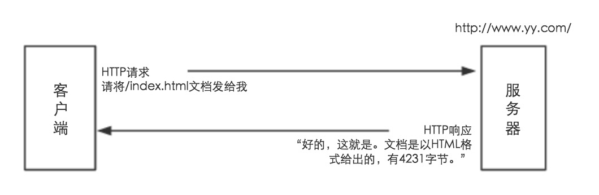
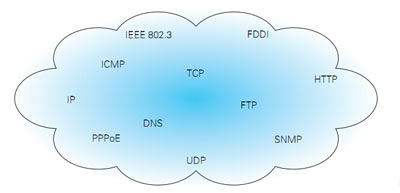

##了解web及网络技术
###web客户端和服务器

浏览一个页面（ 如：http://www.yy.com/index.html ）时，浏览器会向服务器( http://www.yy.com/ )发送一条HTTP请求。服务器寻找所期望的对象，如果成功，就将对象、对象类型、对象长度及其他一些信息放在HTTP响应中发送给客户端。

###网络基础TCP/IP
####TCP/IP协议族
通常使用的网络（包括互联网）是在TCP/IP协议族的基础上运作的。**HTTP属于它内部的一个子集。**

###TCP/IP分层管理
* 应用层
	向用户提供一组常用的应用程序，比如电子邮件、文件传输访问、远程登录等。
    协议主要是：SMTP、FTP、TELNET、DNS、NFS、HTTP。
* 传输层
	提供端对端的接口，主要功能是数据格式化、数据确认和丢失重传等
    传输层协议规定接收端必须发回确认，并且假如分组丢失，必须重新发送，即耳熟能详的“三次握手”过程
    协议主要是：TCP、UDP
* 网络层
	负责相同或不同网络中计算机之间的通信,主要处理数据报和路由
    协议主要是：IP（网际协议）、ICMP（Internet Control Message Protocol,因特网控制报文协议）、ARP（Address Resolution Protocol，地址解析协议）、RARP（Reverse Address Resolution Protocol，反向地址解析协议）
* 链路层（网络接口层）
	数据链路层是负责接收IP数据包并通过网络发送，或者从网络上接收物理帧，抽出IP数据包，交给IP层
